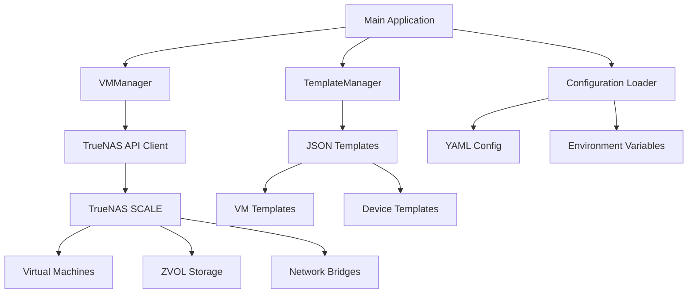

# Architecture Documentation

## Overview

TrueNAS VM Manager is designed as a modular Python application that provides automated VM provisioning and management for TrueNAS SCALE systems. The architecture follows a clean separation of concerns with template-based configuration management.

## System Architecture



## Core Components

### 1. TemplateManager

**Purpose**: Manages loading and processing of JSON templates for VM and device configurations.

**Responsibilities**:
- Load JSON templates from filesystem
- Create VM specifications from templates
- Generate device configurations (disk, network, display, CDROM)
- Template validation and error handling

**Key Methods**:
- `create_vm_spec()` - Creates VM configuration from template
- `create_disk_device()` - Generates disk device configuration
- `create_nic_device()` - Creates network interface configuration
- `create_display_device()` - Generates SPICE display configuration
- `create_cdrom_device()` - Creates CDROM device configuration

### 2. VMManager

**Purpose**: Handles VM lifecycle operations and TrueNAS API interactions.

**Responsibilities**:
- Establish secure API connections to TrueNAS
- Orchestrate VM creation and configuration
- Manage device attachment to VMs
- Handle error recovery and cleanup
- Perform batch VM operations

**Key Methods**:
- `connect()` / `disconnect()` - API connection management
- `create_vm_type()` - Create multiple VMs of a specific type
- `_create_single_vm()` - Create individual VM with devices
- `destroy_managed_vms()` - Clean up managed VMs

### 3. Configuration Management

**Purpose**: Load and validate configuration from multiple sources.

**Components**:
- **YAML Configuration**: VM specifications and storage settings
- **Environment Variables**: Secure credential management
- **Template Files**: JSON-based device and VM templates

## Data Flow

### VM Creation Process

1. **Configuration Loading**
   ```
   YAML Config → Validation → Configuration Object
   Environment Variables → Credential Validation
   ```

2. **Template Processing**
   ```
   JSON Templates → Template Manager → Device Specifications
   ```

3. **VM Creation**
   ```
   Configuration + Templates → VM Manager → TrueNAS API → VM Instance
   ```

4. **Device Attachment**
   ```
   Device Templates → Device Creation → Attachment to VM
   ```

### VM Destruction Process

1. **VM Discovery**
   ```
   TrueNAS API Query → VM List → Filter by Prefix
   ```

2. **VM Shutdown**
   ```
   Power Off Command → VM Shutdown → Status Verification
   ```

3. **Cleanup**
   ```
   VM Deletion → ZVOL Cleanup → Resource Deallocation
   ```

## Template System

### Template Structure

Templates are organized in a hierarchical structure:

```
templates/
├── vms/
│   └── vm.json          # Base VM configuration
└── devices/
    ├── disk.json        # Storage device template
    ├── nic.json         # Network interface template
    ├── display.json     # SPICE display template
    └── cdrom.json       # CDROM device template
```

### Template Processing

1. **Loading**: Templates are loaded at startup and cached in memory
2. **Deep Copy**: Each template usage creates a deep copy to prevent modification
3. **Parameter Injection**: Runtime parameters are injected into template copies
4. **Validation**: Template structure is validated during loading

## Storage Architecture

### ZVOL Management

- **Base Path**: Configurable via `storage.pool_path` in config.yaml
- **Naming Convention**: `{pool_path}/{vm_name}-disk{index}`
- **Automatic Creation**: ZVOLs are created automatically during VM provisioning
- **Cleanup**: ZVOLs are destroyed when VMs are removed

### Storage Examples

```yaml
storage:
  pool_path: "tank/kubernetes-cluster"

# Results in:
# tank/kubernetes-cluster/controlplane01-disk0
# tank/kubernetes-cluster/worker01-disk0
# tank/kubernetes-cluster/worker01-disk1
```

## Network Architecture

### VM Naming Convention

VMs follow a predictable naming pattern:
- **Controlplane**: `controlplane01`, `controlplane02`, `controlplane03`...
- **Worker**: `worker01`, `worker02`, `worker03`...

### SPICE Display Ports

Display ports are automatically assigned based on VM type:
- **Controlplane**: 5911, 5912, 5913...
- **Worker**: 5921, 5922, 5923...

### Network Interfaces

- **Bridge Attachment**: VMs connect to specified bridge interfaces
- **VIRTIO Driver**: High-performance network virtualization
- **Multi-Network**: Support for multiple network interfaces per VM

## Security Architecture

### Authentication

- **API Authentication**: Username/password authentication with TrueNAS
- **Secure Connection**: WebSocket-based API communication
- **Session Management**: Automatic session cleanup on exit

### Credential Management

- **Environment Variables**: Sensitive data stored outside codebase
- **File Permissions**: Recommendation for restricted .env file access
- **No Hardcoded Secrets**: All credentials configurable at runtime

### VM Security

- **UEFI Boot**: Modern secure boot support
- **Secure Boot**: Enhanced security for VM boot process
- **Isolated Networks**: VM network isolation via bridge configuration

## Error Handling

### Error Recovery Strategies

1. **VM Creation Failure**
   - Automatic rollback of partially created VMs
   - ZVOL cleanup on failure
   - Detailed error logging

2. **Device Attachment Failure**
   - Individual device error isolation
   - VM cleanup on device failure
   - Continuation with remaining VMs

3. **API Connection Failure**
   - Connection retry logic
   - Graceful degradation
   - Clear error reporting

### Logging Architecture

- **Structured Logging**: Consistent log format with timestamps
- **Log Levels**: DEBUG, INFO, WARNING, ERROR support
- **Component Identification**: Clear identification of logging source
- **Operation Tracking**: Detailed operation progress logging

## Performance Considerations

### Template Optimization

- **Memory Usage**: Templates cached in memory for performance
- **Deep Copy**: Safe template usage with performance trade-off
- **Batch Operations**: Efficient multi-VM creation

### API Efficiency

- **Connection Reuse**: Single API connection for all operations
- **Batch Processing**: Multiple VMs created in single session
- **Error Isolation**: Individual VM failures don't affect others

### Resource Planning

**Recommended System Resources**:
- **CPU**: 2+ cores per concurrent VM creation
- **RAM**: 1GB+ per VM plus system overhead
- **Storage**: SSD or RAID-Z for optimal ZVOL performance
- **Network**: Gigabit ethernet for deployment and SPICE access

## Extensibility

### Adding New VM Types

1. **Configuration**: Add new section to config.yaml
2. **Validation**: Update configuration validation
3. **Creation**: Add creation call in main()
4. **Port Management**: Assign unique port ranges

### Custom Device Types

1. **Template Creation**: Create JSON template in devices/
2. **Method Implementation**: Add creation method to TemplateManager
3. **Integration**: Add device creation to VM workflow

### Template Customization

- **Override Templates**: Use --templates-dir for custom templates
- **Template Inheritance**: Modify existing templates for specific needs
- **Validation**: Ensure custom templates maintain required structure

## Future Considerations

### Scalability Improvements

- **Parallel Creation**: Multiple VMs created simultaneously
- **Connection Pooling**: Multiple API connections for performance
- **Caching**: Template and configuration caching optimization

### Feature Extensions

- **VM Migration**: Support for VM movement between hosts
- **Snapshot Management**: VM snapshot creation and management
- **Monitoring Integration**: VM health and performance monitoring
- **Cloud-Init**: Automated VM configuration on first boot

### API Evolution

- **TrueNAS API Changes**: Adaptation to new API versions
- **Backward Compatibility**: Support for multiple TrueNAS versions
- **Enhanced Features**: New TrueNAS capabilities integration